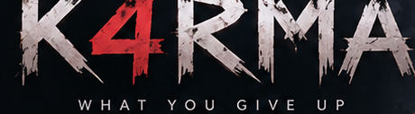
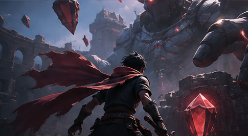
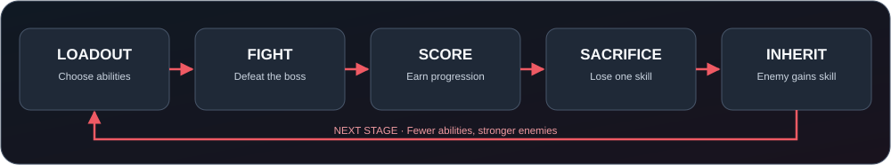

  
   <strong>WHAT YOU GIVE UP COMES BACK.</strong>
   잃어버린 능력이 다음 적의 힘이 된다.
    
  
  
  
  
    
  <a href="README.md"><strong>🇰🇷 한국어</strong></a> &nbsp;|&nbsp; <a href="README.en.md"><strong>🇺🇸 English</strong></a>
   GitHub README: choose a language page · Instant in-place switch: <a href="https://azizbekdevuz.github.io/K4RMA/">GitHub Pages</a>

  
   Concept art / 콘셉트 이미지 · Not actual gameplay / 실제 게임 화면이 아닙니다.

> [!IMPORTANT]
> **K4RMA is a working title in pre-production.** The central loop is the team’s current direction; ability and stage counts, synergy rules, 2D versus 3D, and final visuals are not settled. Planned features are not implemented features.

## Overview

**K4RMA** is a **single-player-first action / boss-combat game** in which each victory forces the player to sacrifice one ability. That ability becomes available to future enemies. As the player loses options, opponents inherit the consequences of earlier choices. Survive by combining the remaining skills, basic attacks, movement, and progression.

**The central question:** *Which ability will you surrender, knowing a later enemy can use it against you?*

### Core game loop

1. **Begin:** Start with baseline stats (HP, attack, movement speed, attack speed) and multiple special abilities. Dash, Fireball, Shield, and Heal are **examples**, not a final skill list.
2. **Fight:** Use basic attacks and remaining abilities. Enemies use basic movement/tracking/attack AI; later enemies may use previously surrendered skills.
3. **Score:** The team is considering kills, clear time, remaining HP, and hits taken as performance inputs. Spending score on baseline stat growth is also under discussion.
4. **Sacrifice:** After a clear, surrender one owned ability. It disappears from the player and enters the pool of abilities available to subsequent enemies.
5. **Repeat:** Face the consequences of earlier choices. Endgame difficulty and beatability will be balanced through playtesting.

### Scope and decision status

| Area | Current direction |
| :--- | :--- |
| Signature mechanic | **Agreed direction:** sacrifice a skill → later enemy/boss may use it |
| Game mode | **Complete single-player combat first** |
| Engine | **Unity**; Unity C# is the expected implementation language |
| Presentation | Investigate third-person 3D feasibility first; fall back to 2D if scope, performance, or skills require it |
| Content counts | Starting loadout, total abilities, stages, and boss count **not decided** |
| Secondary systems | Skill synergies and score-driven base-stat upgrades **under consideration** |
| Multiplayer | **Out of current scope**; preserve reasonable extension points only |

### First playable slice

Validate the actual hook with **one player → one arena → basic attack and a few skills → one boss → surrender a skill → fight an enemy that can use it**. Multiplayer, numerous stages, custom high-end models, and advanced physics are not prerequisites for this prototype.

### Engineering principles

- **Keep it simple without closing off future options.** “Multiplayer-ready” does **not** mean building networking now. Avoid tying all players, abilities, enemies, scores, and UI to one global game object; keep responsibilities explicit and reusable.
- **Apply this beyond code.** Keep player input separate from combat behaviors; design UI so extra player/state displays can be added; prefer reusable character models and animations over assets inseparable from one hard-coded player. Do not overengineer today's MVP for hypothetical features.
- **Give AI the whole relevant context.** Before using AI, include [`docs/PROJECT_CONTEXT.md`](docs/PROJECT_CONTEXT.md), the actual files, agreed Unity version, task boundaries, and related interfaces. Ask technical questions with the desired behavior, current architecture, attempted steps, exact errors, and constraints. Understand, run, and verify generated work before merging it.
- **Build in small, testable increments.** Prove the essential loop, add features progressively, record decisions, and integrate early.

### Collaboration and version control

- **GitHub:** Shared source repository and change history. Aziz owns repository/collaboration setup and integration; implementation roles remain to be assigned.
- **Unity Version Control (formerly Plastic SCM):** Evaluate where asset locking/large binaries require it. **Do not run Git and Unity Version Control as two competing sources of truth.** Agree on and document the authoritative repository and asset workflow first.
- **Notion:** Planned shared workspace for design, meeting notes, assignments, schedule, and decisions.
- **Team workflow:** [`docs/CONTRIBUTING.md`](docs/CONTRIBUTING.md) · **Decision log:** [`docs/DECISIONS.md`](docs/DECISIONS.md)

### Setup

**There is no verified runnable build yet** if the Unity project or selected editor version has not been committed. Once the team selects a version, target platform, and project location, replace this section with tested setup/run instructions. Do not assume an unverified Unity version or invent a run command.

### Roadmap

| Phase | Outcome | Status |
| :--- | :--- | :--- |
| Discovery | Specify core rules, assess 2D/3D, assign roles | In progress |
| Core prototype | Test sacrifice → enemy inheritance loop | Planned |
| Playable MVP | Integrate input, combat, enemy AI, UI, transitions | Planned |
| Content and balance | Expand skills/bosses; decide scoring, upgrades, synergies | Planned |
| Verification and demo | Playtest, fix defects, prepare demonstration/docs | Planned |

### Team, assets, and license

**SW Basic Design · four-person university team.** All four members' Korean names begin with ㄱ/K, and `4` represents the four members. **K4RMA is a working title pending team approval.** Do not share private plans, code, or assets externally without team consent. Record attribution and license terms for third-party assets. **A license for the repository as a whole has not yet been selected.**
